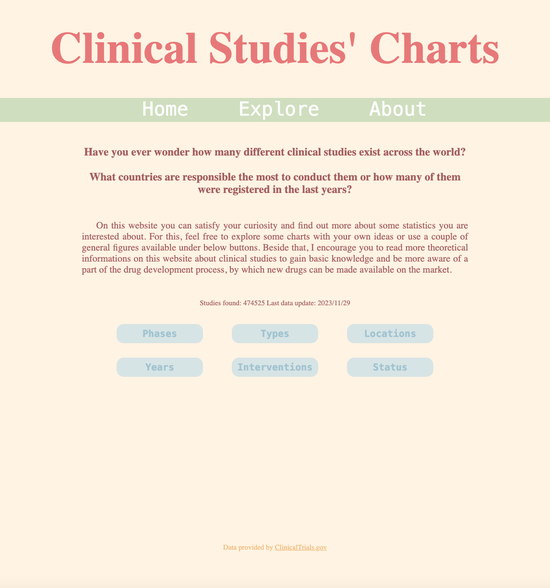
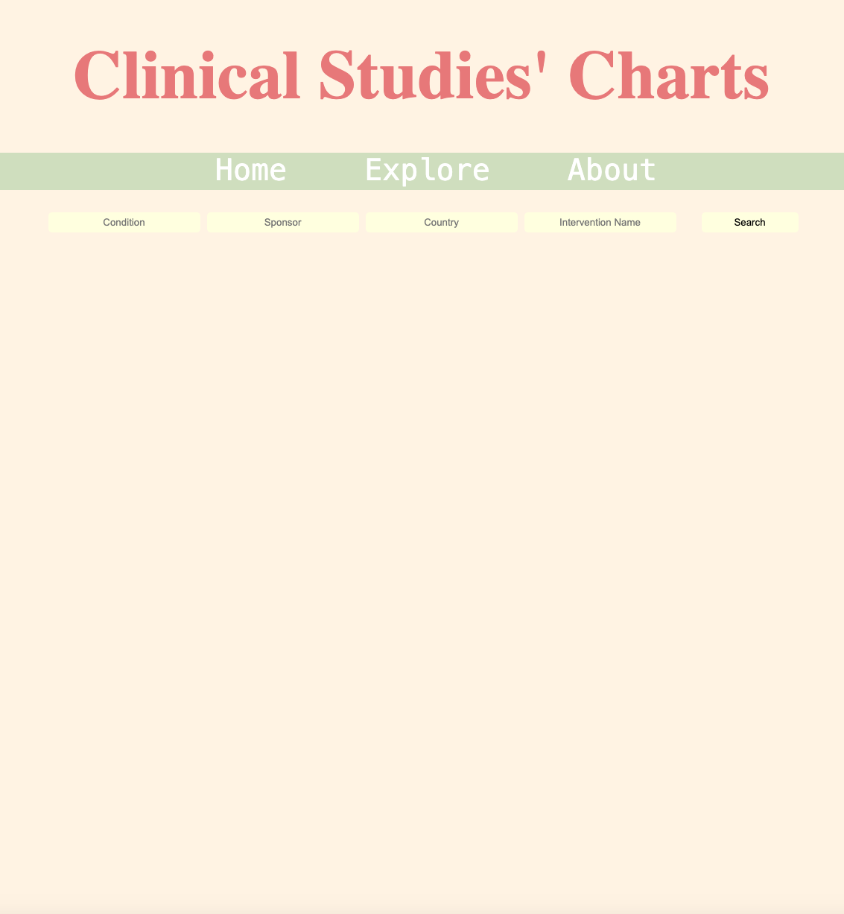
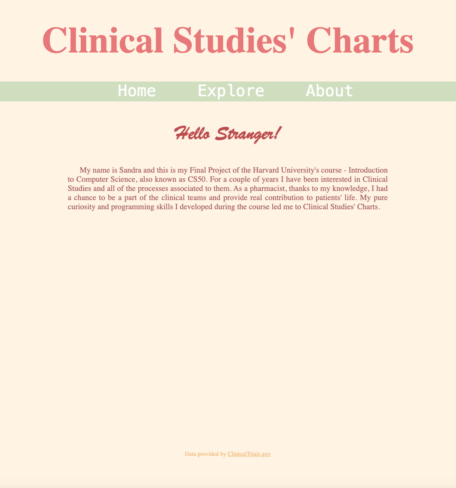

# Clinical Studies' Charts - CS50 Final Project

## General information:
Clinical Studies's Charts is my final project for Harvard University's course - Introduction to Computer Science. It is a web application where you can check statistics about Clinical Studies conducted all over the world. General charts consist data about clinical phases, studies types and statuses, interventions, how many studies and where were performed. Besides that you can set your own filters and explore more statistics which interest you the most.

Data originate from clinicaltrials.gov.

## Architecture:
To get a specific data the application is quering API of the clinicaltrials.gov database. Charts are created by using JavaScript's library - Chart.js.

Project's folder consists:
- static folder with css styles
- templates folder with all project's templates consist html pages
- app.py file with main python flask code
- helpers.py file with additional python functions

Technologies used:
- Flask
- JavaScript
- HTML
- CSS

## Process:
I've started off by creating blank pages for each part of my application and picking color scheme. I've used color palette generator to pick matching colors for whole web app.
The next step was to test clinicaltrials.gov API and make sure that I'm able to fetch desired data. After making couple of successful requests I've moved on to Chart.js library.
I had some issues with injecting data fetched from Flask side to Chart.js script via Jinja templating, but after solving those I was ensured that all of my initial goals can be achieved.
After finishing predefined charts on my home page, I moved on to explore tab where I've prepared a HTML form. Initial implementation had no validation whatsoever, but I've just
wanted to test it and make sure that user can make any requests with valid data. Afterwards I've added validation from backend side and moved on to polishing whole app.
I've made final amendments to styles, about page, and I've created loader when user is doing requests. I ended up by adding theoretical information to predefined charts.

## Pictures:

## About CS50:
Introduction to the intellectual enterprises of computer science and the art of programming for majors and non-majors alike, with or without prior programming experience. CS50x teaches students how to think algorithmically and solve problems efficiently. Topics include abstraction, algorithms, data structures, encapsulation, resource management, security, software engineering, and web development. Languages include C, Python, SQL, and JavaScript plus CSS and HTML.

Find out more on https://cs50.harvard.edu/x/2023/
